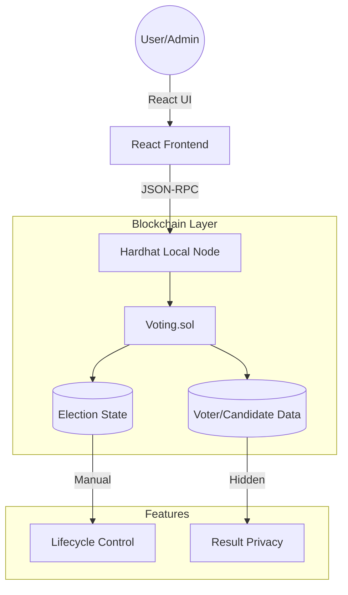

# VoteChain Pro 🗳️

## 1. Introduction
**VoteChain Pro** is a premium, full-stack decentralized voting application (dApp) designed for local blockchain demonstrations. It provides a secure, transparent, and user-friendly platform for conducting elections without the need for external wallet extensions like MetaMask or Ganache. The application features a rigorous manual lifecycle management system, on-chain result privacy, and a pre-configured 10-account simulation environment.

## 2. Problem Statement
Traditional voting systems often suffer from transparency issues, centralized points of failure, and the risk of double-voting or tampering. Furthermore, many existing dApp demonstrations are complex to set up, requiring specific browser extensions and manual configuration of several accounts. **VoteChain Pro** addresses these challenges by:
- Enforcing transparency through a public (local) blockchain.
- Ensuring **Result Privacy** during active voting periods to prevent bandwagon effects.
- Providing **Manual Control** over election states to simulate real-world governance.
- Eliminating setup friction through **Auto-Registration** and a built-in account switcher.

## 3. Architectural Diagrams

### Core System Workflow

```mermaid
sequenceDiagram
    participant Admin as Admin (Account 0)
    participant Contract as Voting Smart Contract
    participant Voter as Voter (Accounts 0-9)
    participant UI as React Frontend

    rect rgb(20, 25, 40)
    Note over Admin, UI: Election Phase: Setup
    Admin->>UI: Set Name & Max Candidates
    UI->>Contract: setElectionName() / setMaxCandidates()
    Admin->>UI: Add Candidates
    UI->>Contract: addCandidate()
    end

    rect rgb(30,30,50)
    Note over Admin, UI: Election Phase: Active
    Admin->>UI: Start Election
    UI->>Contract: startElection()
    Voter->>UI: Cast Vote
    UI->>Contract: vote(candidateID)
    UI->>Contract: getVoteCounts() (Returns Zeros)
    Note right of UI: Results hidden from UI 🔒
    end

    rect rgb(20, 40, 30)
    Note over Admin, UI: Election Phase: Ended
    Admin->>UI: End Election
    UI->>Contract: endElection()
    UI->>Contract: getVoteCounts() (Returns Real Data)
    Note right of UI: Winner & Ties Revealed 🏆
    end
```


### Component Architecture


## 4. Tech Stack
- **Smart Contract**: Solidity 0.8.x (State machines, modifiers, custom mappings)
- **Blockchain Env**: Hardhat (Local Node & built-in accounts)
- **Frontend**: React 19 (Hooks, UseMemo, Polling)
- **Styling**: Vanilla CSS (Premium Dark Theme, Glassmorphism)
- **Connectivity**: Ethers.js v5 (Direct private key signing)
- **Architecture**: Vite (HMR & Fast Build)

## 5. Steps to Run

### 1. Initialize Blockchain
In the root directory, start the local Hardhat network:
```bash
npm install
npx hardhat node
```

### 2. Deploy & Auto-Register
In a new terminal, deploy the contract. This script also pre-registers all 10 simulator accounts:
```bash
.\node_modules\.bin\hardhat.ps1 run scripts/deploy.js --network localhost
```

### 3. Launch Frontend
```bash
cd frontend
npm install
npm run dev
```
Open **[http://localhost:4173/](http://localhost:4173/)** to begin the demonstration.

---
### 🔒 Security Note
This project is built for **local simulation and academic demonstration**. Private keys are exposed in `constants.js` for ease of testing and should never be used on a public mainnet.
